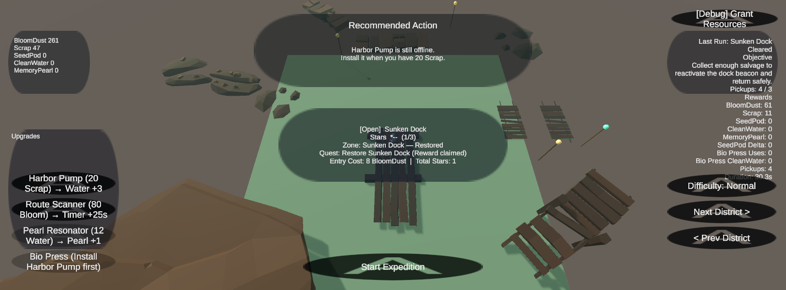
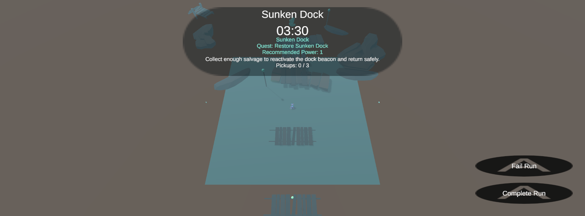

# Project Moss Harbor

[](https://unity.com/releases/editor/whats-new/2022.3.32)
[](design/00_index.md)
[](design/01_high_concept.md)
[](https://github.com/akillness/concept_games/commits/main)

`Project Moss Harbor`는 오염된 부유 항구를 정화하고 복원하는 탑다운 3D 코지 어드벤처 프로토타입입니다. 짧은 원정에서 자원을 회수하고, 허브로 돌아와 지구를 복원하며, 6개 지구를 순차적으로 되살리는 8시간 분량의 메타 진행을 목표로 설계했습니다.

## Gameplay Preview


- MP4 다운로드: [media/moss-harbor-gameplay.mp4](media/moss-harbor-gameplay.mp4)
- 대표 이미지: [media/moss-harbor-gameplay-poster.png](media/moss-harbor-gameplay-poster.png)

## Live Play Captures

허브 실제 플레이 캡처:



원정 실제 플레이 캡처:



최신 QA 증적과 체크리스트 상태는 [docs/QA/01_ultraqa_execution_report.md](docs/QA/01_ultraqa_execution_report.md), [docs/qa_verification_checklist.md](docs/qa_verification_checklist.md)에서 확인할 수 있습니다.

## Core Loop

1. 허브에서 목표와 해금 상태를 확인합니다.
2. 원정을 시작해 BloomDust, Scrap, CleanWater, MemoryPearl을 모읍니다.
3. 지구별 목표를 완료하고 Results 화면으로 귀환합니다.
4. 허브 업그레이드와 복원 상태를 갱신하며 다음 지구를 엽니다.

현재 프로토타입은 `Boot -> Hub -> Expedition_Runtime -> Results -> Hub` 흐름을 플레이할 수 있습니다.

## Current Prototype Features

- 지구별 `DistrictContentBundle` 기반 허브/원정/정산 UI
- 원정 보상과 허브 복원 상태가 연결되는 저장 시스템
- 지구 선택, 업그레이드, 스타 해금, 튜토리얼 상태 관리
- ScriptableObject 중심 데이터 구조와 EditMode 테스트
- 구현용 상세 기획 문서 패키지 포함
- 난이도 시스템 (Easy/Normal/Hard) — 타이머, 입장 비용, 별점 기준, 실패 시 자원 보존율 조정
- CharacterController 기반 물리 충돌과 중력 처리
- 픽업 오브젝트 bob/proximity scale/수집 shrink 애니메이션
- 비콘 pulse 애니메이션 (목표 달성 시 활성화)
- 씬 전환 이벤트 시스템과 비동기 페이드 효과
- SeedPod 비율 검증용 run summary telemetry (`seedPodDelta`, `bioPressUseCount`, `bioPressCleanWaterConverted`)
- district별 `BoundaryRecoveryProfile` 기반 경계 복귀
- 에디터 UV import guardrail (`Tools/Moss Harbor/Validation/Audit Player UV Guardrail`)
- 6개 지구별 맵 레이아웃과 기믹 동선 설계 (기획 문서)
- 10개 시스템 구현 상태 추적 및 기획-코드 매핑 문서

## Controls

- 이동: `WASD`
- 달리기: `Shift`
- UI 조작: 마우스 클릭
- 허브: `Start Expedition`, 지구 선택, 업그레이드 버튼
- 원정: 픽업 수집 후 `Complete Run` 또는 `Fail Run`

## Difficulty

게임 난이도는 허브 화면에서 변경할 수 있습니다.

| 모드 | 타이머 | 입장 비용 | 실패 보존율 | 별점 기준 |
|------|--------|-----------|-------------|-----------|
| Easy | +30% | -30% | 85% | 완화 |
| Normal | 기본값 | 기본값 | 70% | 기본값 |
| Hard | -20% | +30% | 50% | 강화 |

## District Progression

6개 지구를 순차적으로 해금하며 진행합니다.

| 지구 | 해금 조건 | 목표 유형 | 예상 세션 |
|------|-----------|-----------|-----------|
| Dock (안개 부두) | 즉시 | 픽업 수집 | ~3.5분 |
| Reed Fields (갈대 습지) | 1★ | 자원 수집 (SeedPod) | ~3.3분 |
| Tidal Vault (조수 금고) | 2★ | 자원 수집 (CleanWater) | ~3분 |
| Glass Narrows (유리 해협) | 4★ | 거점 방어 (60초) | ~3분 |
| Sunken Arcade (침수 아케이드) | 6★ | 픽업 수집 | ~2.8분 |
| Lighthouse Crown (등대 왕관) | 8★ | 거점 방어 (75초) | ~2.5분 |

## Open In Unity

1. Unity Hub에서 `concept_game` 폴더를 엽니다.
2. Unity Editor 버전 `2022.3.32f1`을 사용합니다.
3. 시작 씬은 `Assets/Scenes/Boot.unity`입니다.
4. Play를 누르면 허브에서 런타임 UI가 자동 생성됩니다.

## Project Structure

```text
concept_game/
  Assets/
    Art/
    Scenes/
    Scripts/
    Resources/ScriptableObjects/
    Tests/EditMode/
  Packages/
  ProjectSettings/
art/
  00_index.md
  01_asset_replacement_spec.md
  02_asset_inventory_and_decisions.md
  03_progress_log.md
design/
  00_index.md
  01_high_concept.md
  ...
media/
  moss-harbor-gameplay.gif
  moss-harbor-gameplay.mp4
  moss-harbor-gameplay-poster.png
```

## Design Docs

- planning summary: [docs/summary/00_index.md](docs/summary/00_index.md)
- 기획 인덱스: [design/00_index.md](design/00_index.md)
- 하이 콘셉트: [design/01_high_concept.md](design/01_high_concept.md)
- 코어 루프: [design/03_core_loop_and_progression.md](design/03_core_loop_and_progression.md)
- Unity 기술 스펙: [design/09_unity_technical_spec.md](design/09_unity_technical_spec.md)
- 게임플레이 시스템 통합 명세: [design/15_gameplay_systems_spec.md](design/15_gameplay_systems_spec.md)
- 게임성 강화 변경 이력: [design/16_gameplay_enhancement_changelog.md](design/16_gameplay_enhancement_changelog.md)
- 지구별 맵 레이아웃: [design/17_district_map_layouts.md](design/17_district_map_layouts.md)
- 통합 기술 레퍼런스: [design/18_consolidated_technical_reference.md](design/18_consolidated_technical_reference.md)

## Notes

- 루트 `.gitignore`는 Unity `Library`, `Temp`, `Logs`, 생성된 `.csproj`/`.sln` 파일을 제외하도록 구성했습니다.
- 이 저장소는 구현용 프로토타입과 기획 문서를 함께 관리합니다.
